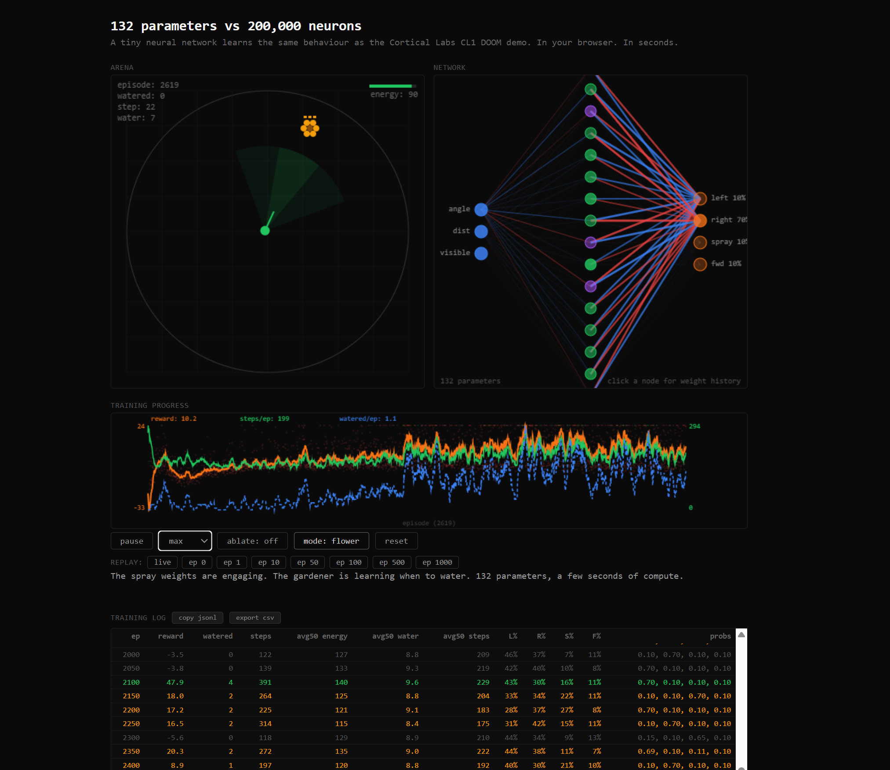

# 132 Parameters vs 200,000 Neurons

**[braindoom.mikeayles.com](https://braindoom.mikeayles.com)**

**[Read the full writeup](https://www.mikeayles.com/blog/its-just-weights/)** — the long-form argument, with the live demo embedded.



A tiny neural network learns the same behaviour as the Cortical Labs CL1 DOOM demo. In your browser. In seconds.

## What is this?

An interactive demo that reproduces the "brain cells play DOOM" behaviour with a 132-parameter feedforward neural network, training live in the browser. The core argument: biological neurons adapting to stimulus is weight adjustment, the same thing a conventional neural network does, the same thing your muscles do at the gym.

## The network

```
Input (3) → Dense (16, tanh) → Dense (4, softmax) → Action
```

Three inputs (enemy angle, distance, visibility), sixteen hidden neurons, four action outputs (turn left, turn right, shoot, move forward). 132 trainable parameters. No frameworks, no GPU, hand-rolled in TypeScript.

## Running locally

```bash
npm install
npm run dev
```

Open `http://localhost:5173`.

## Features

- Real-time training visualisation (arena + network weights + reward chart)
- Ablation toggle (replaces network output with random actions)
- Snapshot replay (compare behaviour at episode 0, 10, 100, 1000, etc.)
- Training log with per-episode diagnostics
- Flower/DOOM theme toggle

## How it works

The agent sits in a 2D arena with enemies spawning at random positions. It receives the same three decision-relevant variables that the CL1 encoding pipeline distils from game state (enemy bearing, distance, visibility) and must learn to turn toward the enemy and shoot. Training uses policy gradient with symmetric data augmentation, learning rate decay, and a best-checkpoint ratchet to prevent catastrophic forgetting.

## Blog post

**[Read the full writeup on mikeayles.com](https://www.mikeayles.com/blog/its-just-weights/)** — source lives in `blog/index.mdx` with JSX components in `blog/components/`.

## Build

```bash
npm run build    # outputs to dist/
npm run preview  # preview production build
```

## Deployment

Deployed to GitHub Pages at [braindoom.mikeayles.com](https://braindoom.mikeayles.com) via GitHub Actions on push to main.

## License

[MIT](LICENSE)
